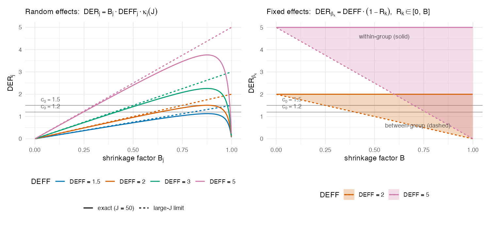

# The DER in brief

This chapter states just enough of the framework to make the code readable. The
definitions, theorems, and proofs are in the paper [@LeeWilliamsSavitsky2026];
here we keep to what a replicator needs.

## The diagnostic

Fit a Bayesian hierarchical model to survey data as a weighted pseudo-posterior.
For each parameter $\phi_k$ (a fixed effect $\beta$ or a random intercept
$\theta_j$), the **Design Effect Ratio** compares two variances,

$$
\mathrm{DER}_k \;=\; \frac{[V_{\text{target}}]_{kk}}{[\Sigma_{\text{MCMC}}]_{kk}},
$$

where $\Sigma_{\text{MCMC}}$ is the pseudo-posterior (model-based) covariance and
$V_{\text{target}} = H^{-1} J_c H^{-1}$ is a design-based sandwich variance for a
**declared variance target**. The bread $H$ is the penalized posterior Hessian;
the meat $J_c$ is the stratified, centered, degrees-of-freedom-corrected outer
product of cluster-level score totals [@Binder1983].

Three regimes follow directly:

- $\mathrm{DER}_k > 1$ --- the posterior understates design uncertainty, so the
  interval should be **widened**.
- $\mathrm{DER}_k \approx 1$ --- already calibrated; **leave it alone**.
- $\mathrm{DER}_k < 1$ --- the posterior is already wider than the target;
  correcting would wrongly **narrow** it and discard the shrinkage protection.

A "declared variance target" is fixed by two choices that the replicator makes
explicitly: the **aggregation unit** (the design PSU, or the model group) and
the **weight-scaling convention** (global unit-mean, or within-group). The
application evaluates *both* aggregation units; the simulation studies both as
well.

## The four tiers

The closed forms in the paper sort parameters into four tiers by where their
identifying information comes from. The code carries these labels verbatim in
the `param_types` vector.

| Tier | Parameter | DER behavior | Action |
|:--|:--|:--|:--|
| [I-a]{.tier .tier-ia} | within-group fixed effect | $\approx \mathrm{DEFF}$ (fully exposed) | correct |
| [I-b]{.tier .tier-ib} | between-group fixed effect | $\mathrm{DEFF}(1-B)$, often $<1$ (shielded) | monitor |
| [II]{.tier .tier-ii} | random intercept $\theta_j$ | $B\,\mathrm{DEFF}\,\kappa(J)$ (protected by shrinkage) | rarely needed |
| [III]{.tier .tier-iii} | variance hyperparameter | excluded by construction | not certified |

Here $\mathrm{DEFF}$ is the Kish design effect [@Kish1965] and
$B = \sigma^2_\theta / (\sigma^2_\theta + \sigma^2_e / n_j)$ is the shrinkage
(reliability) factor. The decomposition makes precise an intuition the paper
calls a *conservation law*: hierarchical shrinkage does not remove design
sensitivity, it relocates it.

## The closed-form curves (Figure 1)

Figure 1 draws the tier structure directly from the closed forms, with no data.
The random-effect DER is an inverted-U in the shrinkage factor $B$; the
fixed-effect DER spans the band $[\mathrm{DEFF}(1-B),\, \mathrm{DEFF}]$, with
within-group covariates at the upper edge and between-group covariates at the
lower edge. It is produced by `code/03_results/results_01_theory.R`.

{#fig-theory}

## Compute, classify, correct

The diagnostic drives a three-step workflow (Algorithm 1 in the paper), which
`svyder` implements as `der_compute()`, `der_classify()`, and `der_correct()`:

1. **Compute** $\mathrm{DER}_k$ for every parameter.
2. **Classify**: flag the set $\mathcal{F} = \{k : \mathrm{DER}_k > c_0\}$ with
   the default threshold $c_0 = 1.2$ (parameters within 20% of the target are
   left alone).
3. **Correct**: apply a joint block-Cholesky transform to the flagged block
   only, leaving every unflagged parameter untouched. The cost is
   $O(|\mathcal{F}|^3)$ rather than $O(d^3)$.

::: {.callout-note}
The paper denotes the flagging threshold by $c_0$; some helper APIs call the
same argument `tau`. In all cases, the default threshold used here is 1.2.
:::

The rest of this guide shows the two studies that put the diagnostic to work.
