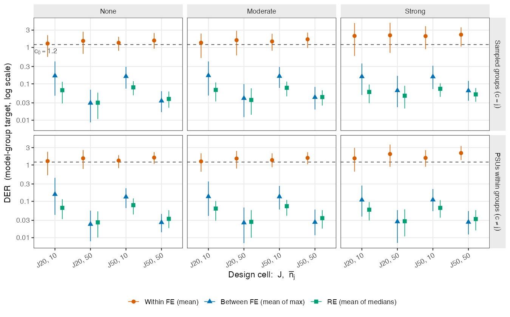
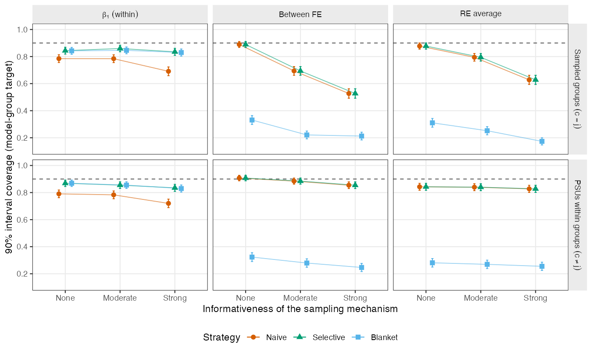

# Simulation: the results

This chapter reproduces the simulation figures and table from the shipped
per-replication results. Everything here is produced by
`code/03_results/results_02_aggregate.R`; the chunks below read the same
per-cell summary it writes.

```{r}
#| label: load
#| echo: false
cells <- readRDS("../data/precomputed/simulation/simulation_cell_summary.rds")
# Pooled weighted mean of a per-cell column, over gate-passing replications.
pool <- function(df, col) sum(df[[col]] * df$n_used) / sum(df$n_used)
```

## Separation (Figure 2)

Under the model-group target, the within-group coefficient's DER tracks the
realized design effect, while the between-group coefficients and the random
effects sit far below the threshold $c_0 = 1.2$. The gap is wide: across the 24
cells, the mean within-group DER exceeds the largest non-target mean DER by a
factor of at least `r sprintf("%.1f", min(cells$sep_factor))`.

{#fig-separation}

```{r}
#| label: separation
#| echo: false
sep <- data.frame(
  Quantity = c("Mean within-group DER, weak informativeness",
               "Mean within-group DER, strong informativeness",
               "Largest between-group cell-mean DER",
               "Separation factor (range over cells)"),
  Value = c(
    sprintf("%.1f", pool(cells[cells$informativeness == "none", ], "der_w_g_mean")),
    sprintf("%.1f", pool(cells[cells$informativeness == "strong", ], "der_w_g_mean")),
    sprintf("%.2f", max(cells$der_b_g_mean)),
    sprintf("%.1f to %.1f", min(cells$sep_factor), max(cells$sep_factor))))
knitr::kable(sep, col.names = c("", "Value"),
             caption = "The within-group coefficient inherits the design effect; the protected classes do not.")
```

## Coverage (Figure 3 and Table 2)

Figure 3 and Table 2 compare three interval strategies at nominal 90% coverage:
**naive** (no correction), **selective** (correct only the flagged block at
$c_0 = 1.2$), and **blanket** (rescale every parameter). Selective correction
restores the exposed coefficient's coverage while leaving the protected classes
exactly as the naive intervals had them; blanket correction repairs the exposed
coefficient too, but at the cost of collapsing the protected classes.

{#fig-coverage}

```{r}
#| label: table2
#| echo: false
arms <- c(sampled_groups = "Sampled groups (c = j)",
          psu_within_groups = "PSUs within groups (c != j)")
rows <- list()
for (arm in names(arms)) {
  for (g in c("none", "moderate", "strong")) {
    sub <- cells[cells$structure == arm & cells$informativeness == g, ]
    for (s in c("nv", "sel", "blk")) {
      sname <- c(nv = "Naive", sel = "Selective", blk = "Blanket")[[s]]
      rows[[length(rows) + 1]] <- data.frame(
        Arm = if (g == "none" && s == "nv") arms[[arm]] else "",
        Informativeness = if (s == "nv") tools::toTitleCase(g) else "",
        Strategy = sname,
        `beta1 (within)` = sprintf("%.3f", pool(sub, paste0("cov_g_", s, "_w"))),
        `FE between`     = sprintf("%.3f", pool(sub, paste0("cov_g_", s, "_b"))),
        `RE average`     = sprintf("%.3f", pool(sub, paste0("cov_g_", s, "_re"))),
        check.names = FALSE)
    }
  }
}
knitr::kable(do.call(rbind, rows), row.names = FALSE,
             caption = "Table 2. 90% interval coverage under the model-group target, pooled over J and n_bar (four cells x 200 replications per block).")
```

The pattern is the same in both arms: naive coverage of the within-group
coefficient falls with informativeness, selective correction pulls it back
toward 0.90, and blanket correction destroys the coverage of the between-group
and random-effect classes.

## Choosing the threshold (Table 5, simulation column)

The default $c_0 = 1.2$ is a deliberate trade-off. A per-replication *false
positive* is a protected (non-target) parameter whose DER wanders above the
threshold; it costs a needlessly wider interval, not invalid inference. The
false-positive rate falls steeply as the threshold rises:

```{r}
#| label: sweep
#| echo: false
# The false-positive rate is the share of gate-passing replications in which any
# non-target parameter exceeds c0; it is pre-aggregated per cell as fp_c**.
fp <- sapply(c(fp_c08 = "0.8", fp_c10 = "1.0", fp_c12 = "1.2",
               fp_c15 = "1.5", fp_c20 = "2.0"),
             function(col) NA)
sweep <- data.frame(
  `c0` = c(0.8, 1.0, 1.2, 1.5, 2.0),
  `False-positive rate (%)` = sprintf("%.1f", 100 * c(
    pool(cells, "fp_c08"), pool(cells, "fp_c10"), pool(cells, "fp_c12"),
    pool(cells, "fp_c15"), pool(cells, "fp_c20"))),
  check.names = FALSE)
knitr::kable(sweep, row.names = FALSE,
             caption = "Simulation false-positive rate across thresholds (pooled over all 24 cells).")
```

At the recommended $c_0 = 1.2$ the rate is about 2%; the largest single
non-target DER observed across all gate-passing replications is 2.15, so the
threshold sits comfortably above the protected parameters' tail. The
[application chapter](07-application-results.qmd) reads the same threshold sweep
off the NSECE fit.
