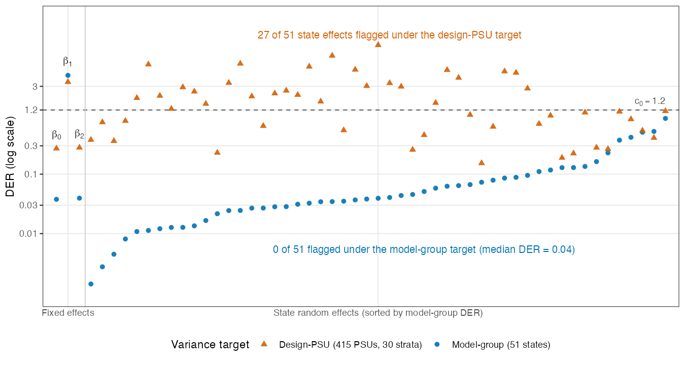

# Application: the diagnostic

This chapter reproduces the NSECE figure and tables from the shipped model
output. The fit itself is produced by `code/02_application/app_02_fit_refit.R`
(Track A, restricted data); everything below reads the two non-identifiable
result files it and its companion write, `nsece_v2_refit.rds` and
`nsece_supp.rds`.

```{r}
#| label: load
#| echo: false
refit <- readRDS("../data/precomputed/application/nsece_v2_refit.rds")
supp  <- readRDS("../data/precomputed/application/nsece_supp.rds")
der_grp <- as.numeric(refit$fit_grp$der)
der_psu <- as.numeric(refit$fit_psu$der)
J <- refit$stan_data_meta$J          # 51 states
ire <- 3 + seq_len(J)                 # random-effect positions
c0 <- 1.2
flag <- function(x) ifelse(x > c0, "yes", "--")
fmt <- function(x, d = 2) formatC(x, format = "f", digits = d)
```

## Two targets, two answers (Table 3, Figure 4)

The poverty coefficient is a within-state ([I-a]{.tier .tier-ia}) covariate; the
intercept and the tiered-reimbursement indicator are between-state
([I-b]{.tier .tier-ib}); the 51 state effects are random intercepts
([II]{.tier .tier-ii}). The diagnostic is computed against both declared
targets. Under the **model-group** target the poverty coefficient is the only
flag; under the **design-PSU** target the poverty coefficient plus a majority of
the state effects cross the threshold.

{#fig-nsece}

```{r}
#| label: table3
#| echo: false
tab3 <- data.frame(
  Parameter = c("beta_0 (intercept)", "beta_1 (poverty, CWC)",
                "beta_2 (tiered reimb.)", "theta_j (51 state effects)"),
  Type = c("Between", "Within", "Between", "Random"),
  `Model-group DER` = c(fmt(der_grp[1], 3), fmt(der_grp[2], 3),
                        fmt(der_grp[3], 3),
                        paste0("median ", fmt(median(der_grp[ire]), 3))),
  `Flag (MG)` = c(flag(der_grp[1]), flag(der_grp[2]), flag(der_grp[3]),
                  sprintf("%d of 51", sum(der_grp[ire] > c0))),
  `Design-PSU DER` = c(fmt(der_psu[1], 3), fmt(der_psu[2], 3),
                       fmt(der_psu[3], 3),
                       paste0("median ", fmt(median(der_psu[ire]), 2))),
  `Flag (PSU)` = c(flag(der_psu[1]), flag(der_psu[2]), flag(der_psu[3]),
                   sprintf("%d of 51", sum(der_psu[ire] > c0))),
  check.names = FALSE)
knitr::kable(tab3, row.names = FALSE,
             caption = sprintf("Table 3. DER for all 54 parameters under both targets. Flagged totals: %d of 54 (model-group), %d of 54 (design-PSU).",
                               sum(der_grp > c0), sum(der_psu > c0)))
```

```{r}
#| label: widen
#| echo: false
ciq <- function(x) unname(quantile(x, c(0.05, 0.95)))
nv  <- ciq(refit$draws[, 2])
cor <- ciq(refit$fit_psu$corrected_draws[, 2])
```

Selectively correcting the poverty coefficient under the design-PSU target
widens its 90% credible interval from
[`r fmt(nv[1], 3)`, `r fmt(nv[2], 3)`] to
[`r fmt(cor[1], 3)`, `r fmt(cor[2], 3)`], a factor of
`r fmt(diff(cor) / diff(nv), 2)`. Blanket correction would instead have narrowed
53 of the 54 intervals toward a rank-deficient state-level target --- which is
precisely the harm the diagnostic is designed to avoid.

## The weight convention matters (Table 4)

The declared convention (global unit-mean on the raw design weights) and the
alternative (within-state scaling) are two *different* pseudo-posteriors,
because the weights enter the pseudo-likelihood itself [@PfeffermannEtAl1998].
The `nsece_supp.rds` file carries the within-state quantities, computed from the
restricted microdata in `app_03_der_supplement.R`.

```{r}
#| label: table4
#| echo: false
tab4 <- data.frame(
  `Weight convention` = c("Global unit-mean (declared)", "Within-state scaling"),
  `DER(beta_1) MG` = c(fmt(der_grp[2]), fmt(supp$convention$within_der_b1_grp)),
  `DER(beta_1) PSU` = c(fmt(der_psu[2]), fmt(supp$convention$within_der_b1_psu)),
  `Flagged MG` = c(sum(der_grp > c0), supp$convention$within_flag_grp),
  `Flagged PSU` = c(sum(der_psu > c0), supp$convention$within_flag_psu),
  check.names = FALSE)
knitr::kable(tab4, row.names = FALSE,
             caption = "Table 4. Sensitivity to the declared weight convention.")
```

The two conventions reallocate effective information across states (the
effective state sample sizes run over [`r round(supp$eff_within["min"])`,
`r format(round(supp$eff_within["max"]), big.mark = ",")`] under within-state
scaling versus [`r round(supp$eff_global["min"])`,
`r round(supp$eff_global["max"])`] under the global convention), which reverses
the ordering of the two targets for the poverty coefficient. What does *not*
change: the poverty coefficient is flagged under all four combinations, and the
random-effect contrast survives.

## The threshold, on real data (Table 5)

Reading the same threshold sweep off the NSECE DER vectors shows how many of the
54 parameters are flagged at each candidate $c_0$, under both targets.

```{r}
#| label: table5
#| echo: false
grid <- c(0.8, 1.0, 1.2, 1.5, 2.0)
tab5 <- data.frame(
  `c0` = grid,
  `Flagged, model-group` = vapply(grid, function(t) sum(der_grp > t), integer(1)),
  `Flagged, design-PSU`  = vapply(grid, function(t) sum(der_psu > t), integer(1)),
  check.names = FALSE)
knitr::kable(tab5, row.names = FALSE,
             caption = "Table 5. NSECE parameters flagged (of 54) at each threshold.")
```

The poverty coefficient is flagged at every threshold shown, under both targets;
the design-PSU count declines smoothly as the threshold rises. Paired with the
[simulation false-positive rates](05-simulation-results.qmd), this is the basis
for the recommended default of $c_0 = 1.2$.
